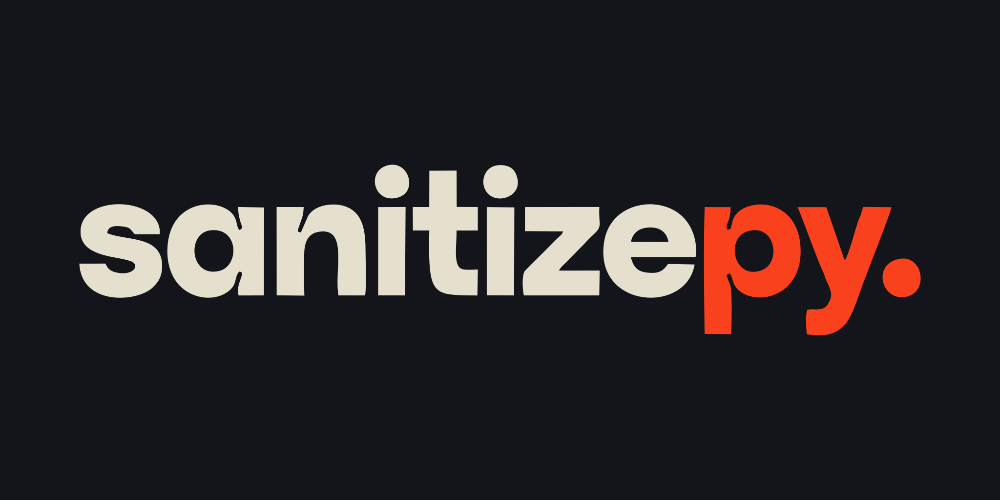

<div align="center">

<!-- Banner placeholder — drop your image here -->


# sanitizepy

### *Automated data quality inspection, explainable cleaning, and preprocessing — in pure Python.*

<br/>

[](https://pypi.org/project/sanitizepy)
[](https://www.python.org)
[](https://github.com/tahahssn/sanitizepy/stargazers)
[](./LICENSE)
<!-- [](https://github.com/tahahssn/sanitizepy) -->

</div>

---

## Overview

`sanitizepy` provides modular, high-performance data engineering components built on top of `pandas`, `numpy`, `scipy`, `rich`, and `pydantic`. The library is designed around a transparent **Detect → Explain → Recommend → Preview → Apply → Validate → Audit** workflow.

`sanitizepy` separates responsibilities into dedicated subsystems:

- **Core Engine & High-Level API** — Centralized `Cleaner` entry point supporting `.inspect()`, `.plan()`, and `.clean(..., dry_run=True)`.
- **Dataset Health & Inspection** — Read-only dataset analysis covering completeness, uniqueness, consistency, validity, datatypes, memory consumption, and statistical distributions with a composite **Dataset Health Score (0–100)**.
- **Explainable Recommendations & Planning** — Rule-based issue detection with human-readable explanations (`WHAT`, `WHY`, `SEVERITY`, `EVIDENCE`, `RECOMMENDATION`) and previewable `CleaningPlan` instances.
- **Cleaning Engine** — Safe, deterministic dataset transformations with dry-run support, before/after impact metrics, and detailed audit trails.
- **Preprocessing & Feature Engineering** — Stateful fit/transform operations for interactions, ratio features, polynomial terms, logarithmic transformations, and datetime extraction.
- **Rule Engine** — Quality validation framework with built-in rules, severity levels, and category classifications.
- **Report Engine** — Structured report generation, rendering (Text, JSON), and exporting (String, File).
- **Pipeline Engine** — Execution workflow orchestration with step timing and metadata tracking.

---

## Capabilities

| Area | Component | Key Functionality |
|---|---|---|
| **Core & High-Level API** | `Cleaner`, `CleanerConfig` | Unified entry point for `.inspect()`, `.plan()`, `.clean(..., dry_run=True)` |
| **Dataset Health & Inspection** | `Cleaner.inspect()`, `MissingValueInspector`, `DuplicateInspector`, `DatatypeInspector`, `MemoryInspector`, `StatisticsInspector` | Dataset Health Score (0–100), severity scoring, memory estimation, distribution stats |
| **Recommendations & Planning** | `CleaningPlan`, `IssueDetector` | Human-readable recommendations, issue severity classification (`critical`, `warning`, `info`), previewable execution plan |
| **Cleaning Engine** | `CleaningEngine`, `DropMissingRows`, `DropMissingColumns`, `FillMissing`, `DropDuplicates`, `DropColumns` | Deterministic cleaning operations with `dry_run` support, `OperationResult`, and immutable audit log |
| **Preprocessing** | `FeatureEngineeringEngine`, `ColumnInteraction`, `RatioFeature`, `PolynomialFeature`, `LogFeature`, `DatetimeFeatures` | Stateful fit/transform feature generation preserving dataset indices |
| **Rules** | `RuleEngine`, `RuleRegistry`, `Rule`, `register_builtin_rules` | Data quality rules, severity levels (`info`, `warning`, `error`, `critical`), custom rules |
| **Reporting** | `ReportEngine`, `TextRenderer`, `JSONRenderer`, `StringExporter`, `FileExporter` | Structured immutable reports with multi-format rendering and exporting |
| **Pipeline** | `PipelineEngine`, `CallableStep`, `TransformStep` | Sequenced workflow execution with step duration and row/column metrics |

---

## Requirements

- **Python**: `>=3.11`
- **Core Dependencies**:
  - `numpy >= 1.24.0`
  - `pandas >= 2.0.0`
  - `scipy >= 1.10.0`
  - `rich >= 13.0.0`
  - `pydantic >= 2.0.0`

---

## Installation

### Standard

```bash
pip install sanitizepy
```

```bash
python -m pip install sanitizepy
```

### Developer / Contributor

```bash
git clone https://github.com/tahahssn/sanitizepy.git
cd sanitizepy
pip install -e .[dev]
```

---

## Quick Start — High-Level API

The recommended entry point is the `Cleaner` class or the module-level convenience functions `inspect()`, `plan()`, and `clean()`.

```python
import pandas as pd
from sanitizepy import Cleaner

df = pd.read_csv("your_data.csv")

# 1. Inspect — Understand what's wrong
c = Cleaner()
report = c.inspect(df)
report.show()                     # Rich terminal health report

print(f"Health Score: {report.health_score}/100")
print(f"Critical Issues: {len(report.critical_issues)}")
print(f"Recommendations: {len(report.recommendations)}")

# 2. Plan — Generate a previewable cleaning plan
plan = c.plan(report)
plan.show()                       # Tabular plan preview

plan.disable(2)                   # Disable step #2
plan.enable(2)                    # Re-enable step #2

# 3. Clean — Dry run or apply for real
dry_result = c.clean(df, plan=plan, dry_run=True)
print(dry_result.summary())

result = c.clean(df, plan=plan, dry_run=False)
cleaned_df = result.data

print(result.summary())           # Human-readable summary
print(result.audit_log)           # JSON-serializable audit trail
```

### Convenience Functions

```python
from sanitizepy import inspect, plan, clean

report = inspect(df)
cleaning_plan = plan(report)
result = clean(df, cleaning_plan=cleaning_plan, dry_run=True)
```

---

## Advanced Usage — Direct Engine Access

For granular control, use the individual engines directly:

```python
from sanitizepy.cleaning import CleaningEngine, DropDuplicates, FillMissing
from sanitizepy.inspection import MissingValueInspector

# Read-only inspection
inspector = MissingValueInspector()
inspection_result = inspector.inspect(df)

# Manual cleaning engine
engine = CleaningEngine([
    FillMissing(value=0.0, subset=["numeric_column"]),
    DropDuplicates(keep="first"),
])

result = engine.run_with_result(df, dry_run=False)
print(result.summary())
print(result.audit_log)
```

---

## Architecture & Design

`sanitizepy` adopts the following transparent workflow: **Detect → Explain → Recommend → Preview → Apply → Validate → Audit**

```
  ┌───────────────────────┐
  │      Dataset          │
  └───────────┬───────────┘
              │
┌─────────────┴─────────────┐
│    Dataset Profiler /     │
│    Issue Detector         │  (Read-Only)
└─────────────┬─────────────┘
              │
┌─────────────┴─────────────┐
│   Recommendation Engine   │  (Explainable)
└─────────────┬─────────────┘
              │
┌─────────────┴─────────────┐
│     Cleaning Plan         │  (Previewable)
└─────────────┬─────────────┘
              │
       user approves
              │
┌─────────────┴─────────────┐
│  Transformation Engine    │  (Deterministic)
└─────────────┬─────────────┘
              │
┌─────────────┴─────────────┐
│    Validation / Audit     │  (Auditable)
└───────────────────────────┘
```

---

## Documentation

Detailed documentation is available in the [`docs/`](./docs) directory:

- [**Installation Guide**](./docs/installation.md) — Requirements, virtual environments, installation commands, verification, and upgrade procedures.
- [**Quick Start Guide**](./docs/quickstart.md) — Step-by-step examples for inspection, cleaning, feature engineering, rules, reporting, and pipelines.
- [**API Reference**](./docs/api.md) — Complete technical API documentation for classes, functions, dataclasses, models, and exceptions.

---

## Development & Testing

### Run Tests

```bash
pytest
```

### Code Formatting & Linting

```bash
black --check src tests
ruff check src tests
mypy src
```

---

## ❤️ Support the Project

<div align="center">

<br/>

<a href="https://www.patreon.com/cw/SyedTahaHassan">
  
</a>

<br/><br/>

### If `sanitizepy` saved you hours of painful data cleaning, consider supporting its development.

Every contribution helps keep this library open-source, actively maintained, and free for everyone.

**[→ Become a Patron on Patreon](https://www.patreon.com/cw/SyedTahaHassan)**

<br/>

</div>

---

## License

`sanitizepy` is distributed under the terms of the [MIT License](./LICENSE).